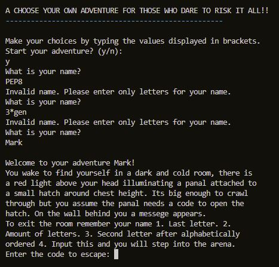

# Hunters Arena: A choose your own adventure text based game

## Live Site

[Hunters Arena](https://hunters-arena-p3-b9fa9043e5cb.herokuapp.com/)

## Table of Contents

- [Hunters Arena](#hunters-arena)
  - [Live Site](#live-site)
  - [Table of Contents](#table-of-contents)
  - [Objective](#objective)
  - [Brief](#brief)
    - [**H**unters **A**rena](#hunters-arena)
  - [UX - User Experience Design](#ux-user-experience-design)
    - [How To Play](#how-to-play)
    - [User Requirements](#user-requirements)
      - [First Time User](#first-time-user)
      - [Returning User](#returning-user)
  - [Features](#features)
    - [Removed Features](#removed-features)
    - [Existing Features](#existing-features)
    - [Future Features](#future-features)
  - [Data Model](#data-model)
  - [Technologies Used](#technologies-used)
    - [Python Packages](#python-packages)
    - [VSCode Extensions](#vscode-extensions)
  - [Testing](#testing)
    - [Manual Testing](#manual-testing)
    - [PEP8 Testing](#pep8-testing)
  - [Bugs](#bugs)
    - [Current](#current)
    - [Resolved](#resolved)
  - [Development](#development)
    - [GitHub](#github)
    - [VSCode](#vscode)
    - [Google Sheets](#google-sheets)
      - [Creating Sheets](#creating-sheets)
      - [API Credentials](#api-credentials)
  - [Deployment](#deployment)
    - [Heroku](#heroku)
  - [Credits](#credits)
     - [Acknowledgements](#acknowledgements)
  - [Project Summary](#project-summary)

---

## Objective

  The primary objective of creating a "Choose Your Own Adventure" Python game for this project is to showcase the depth of Python knowledge acquired during the course at Code Institute. This project serves as a practical demonstration of the skills and techniques learned, encompassing aspects such as data structures, conditional statements, loops, and interactive user input. By developing an engaging and interactive game, I aim to exhibit my proficiency in Python programming and my ability to apply these skills in a creative and practical manner. Additionally, the game provides a platform to demonstrate problem-solving capabilities and the capacity to design and implement a complex, branching narrative, where user choices significantly influence the course of the story. Ultimately, this project is a testament to my expertise in Python and my capacity to create engaging, interactive experiences through coding.

---

## Brief

### **H**unters **A**rena

The core mission of this website is to deliver an immersive and engaging adventure game that unfolds through a multitude of paths and scenarios. The ultimate product is envisioned to fulfill the following critical criteria:

* The game's development strives for a meticulous and error-free execution. Every effort is dedicated to crafting a seamless and bug-free experience.

* The entire endeavor is anchored in the Python programming language, harnessing its versatility and capabilities to bring this adventure to life.

* A hallmark feature is the creation of paths that not only lead to distinct endings but also seamlessly circle back to the beginning. This cyclical design ensures that the game remains enticing for repeated playthroughs.

* Robust error-handling mechanisms are integral to the project. The aim is to gracefully manage user input errors, enhancing the overall user experience and preventing disruptions.

* User-friendliness takes center stage. The website is committed to providing unambiguous, concise instructions on the game's usage and valid inputs, making it accessible to a broad audience.

With these guiding principles, the project aspires to deliver an adventure game that captivates, entertains, and provides a gratifying user experience while exemplifying the coding prowess and flexibility of the Python language.

---

## UX - User Experience Design

### How To Play
Hunters Arena is an immersive choose-your-own-adventure game inspired by the intriguing world of text-based games. You can explore the broader theme of such games on Wikipedia. This particular game is rooted in Stephen King's "The Running Man," where, in our case, the protagonist's survival leads to a remarkable prize of 10 million.

* Getting Started
  - To embark on this adventure, you will begin by entering your name through the console. Once your identity is registered, you'll find yourself transported to a secured holding cell deep within the arena. Your task at this stage is to break free from this confining cell to commence your challenging journey.

* Escape Challenge
  - The key to exiting the holding cell is intricately linked to the name you provided. You have three attempts to input the code correctly. Failure to do so will result in your confinement within the cell, prompting a fresh start to the game. Succeeding in this endeavor, however, allows you to progress to a new area ripe for exploration.

* Navigate the Maze of Possibilities
  - In this expansive world, you'll face a multitude of paths, each leading to varying outcomes. While the majority of these paths may ultimately culminate in adversity and untimely demise, your ultimate objective remains constant: escape through the arena's exit to claim victory.

* Beware of the Hunters
  - Hunters within the arena mirror the menacing public depicted in Stephen King's narrative and are driven by hostile intentions. Trust is a luxury you cannot afford; their intentions are lethal, and the stakes are perilously high.

* Numerous Avenues to Triumph
  - The path to victory is diverse and multifaceted, hinging on your memory, luck, and skill. Success in this adventure is contingent on your ability to make shrewd decisions, adapt to unforeseen challenges, and navigate a labyrinth of possibilities.

With every choice, your fate hangs in the balance, and your journey through Hunters Arena promises to be an enthralling test of your wits and resolve.

### User Requirements

Some example user stories which will affect the design:

#### First Time User

* As an adult, I am eager to rekindle the nostalgic joy of reading a choose-your-own-adventure book. My goal is to recapture the sense of wonder and excitement from those memorable tales.

* As someone with fond memories of childhood adventures, I desire an easily accessible, captivating storyline. My intention is to immerse myself in an engaging narrative reminiscent of the enchanting tales I enjoyed as a child.

* In my new venture into the world of command-line interfaces (CLI), I seek the assurance that my inputs are valid and intuitive. As a newcomer to this environment, I value a user-friendly experience that allows me to navigate without uncertainty.

* As a programmer, I look forward to exploring the diversity and flexibility of the Python language through this project. I aim to appreciate how Python's capabilities can be harnessed to craft interactive and engaging storytelling experiences.

#### Returning User

* As a returning user, I am excited to delve into different paths and explore diverse storylines. My objective is to experience fresh adventures and see where different choices lead me.

* I seek a sense of accomplishment in remembering the story and path correctly. My motivation lies in completing the adventure with a feeling of mastery and satisfaction.

* In the event that I return to the game, I hope to take different paths and still attain victory. My desire is to engage in the game multiple times, each time discovering new routes and outcomes while savoring the thrill of victory.

---

### Initial Concept

I'm planning to create a "Choose Your Own Adventure" game, inspired by the books I enjoyed as a child. Since I have a passion for writing short stories, I came up with the idea of using an API, similar to the one demonstrated in the sample project, to input the different pages or scenarios of the story, representing them as cells in a spreadsheet. This approach will allow me to craft a somewhat intricate narrative, where the user's input shapes the unfolding story. The idea for the story revolves around an escape room scenario, which provides an excellent opportunity to demonstrate various Python commands that I've learned throughout the sample project. This escape room concept served as the foundation for the narrative. 

The overall story has a similar theme to Stephen Kings novel "The Running Man".

### Story Flow

To create and maintain the story path lines the online application Lucid chart was used.
Lucidchart is an online diagramming and visual communication tool that allows users to create various types of diagrams and visual representations. 
It's widely used for a range of purposes, from business process modeling to flowcharts, wireframes, network diagrams, org charts, and more.

To organise the story lines I named each paragraph after the event in the scenario then indicated what cell in the spreadsheet it is located. (This method worked perfectly until i discovered the google API read request error)

---

### Python Logic

Throughout this program the while loop structure was used to generate the users personal story.
In Python, a while loop is a control flow structure that allows you to repeatedly execute a block of code as long as a specified condition remains true. 
Here's the basic structure of a while loop:

1. Condition: The loop begins by evaluating the specified condition (an expression that results in a Boolean value, either True or False). If the condition is initially True, the code block within the loop will be executed. If the condition is initially False, the code block will be skipped, and the loop will terminate immediately.

2. Code Block: The indented code block following the while statement is the body of the loop. This code is executed repeatedly as long as the condition remains True.

3. Loop Execution: After executing the code block, the program returns to the while statement and reevaluates the condition. If the condition is still True, the loop iterates, and the code block is executed again. This process continues until the condition becomes False.

4. Exiting the Loop: The loop will exit when the condition becomes False. This can happen in two ways:

The condition becomes False before the loop starts (e.g., the condition is initially False).
The condition becomes False during the loop's execution. This can occur if some code within the loop modifies variables or conditions in a way that eventually makes the original condition False.
It's essential to ensure that the condition inside a while loop eventually becomes False to prevent an infinite loop. Infinite loops can consume all available CPU resources and crash the program or system.

---
## Features

### Removed Features

* Use of Google Spreadsheets API to request specific cells containing a scenario for each user input.
    - This feature was removed due to an un fixable error that occured on some devices and also when running the iamresponsive online application. 
      - A Google API 429 error is an HTTP status code that indicates that the client, which could be an application has sent too many requests in a given time frame to a Google API service and has exceeded the API's rate limit. This error is also    commonly referred to as "Rate Limit Exceeded."
  Because I only discovered this error after I had created the program and sent out the deployed link to friends they were reporting this error. I also noticed it later when I used iamresponsive to generate an image of various devices. 

  I replaced this feature by creating a new adventure_data.JSON file containing the information in the spreadsheet then created a function in the run.py to draw from the new .JSON file.
 
 

* In the code I developed to access the Google Sheet mentioned earlier, I established a mechanism for retrieving storylines from specific cells within the sheet. Regrettably, we encountered a recurring issue in the form of HTTP 429 errors. These errors emerged particularly when multiple individuals initiated the program concurrently or when various program instances ran simultaneously. This challenge was especially pronounced when utilizing the iamresponsive online application.

Addressing and mitigating these rate-limiting issues was a primary concern, requiring us to revisit our approach to interacting with the Google Sheets API. In light of these challenges, we focused on implementing strategies to optimize our API requests, including rate limiting, exponential backoff, and caching.

These endeavors were aimed at maintaining the integrity and reliability of the program while ensuring that our interactions with the Google Sheets API adhered to its established usage policies. The objective was not only to rectify the immediate issue but also to fortify our application's scalability and robustness in the face of concurrent usage.

This experience has underscored the importance of efficient API usage and proactive measures to accommodate concurrent access, a valuable lesson for future projects.

 
 

### Existing Features

* The program initially questions the user whether they wish to start adventure or not. The game starts after the user inputs a 'y' to the console. 
  
  

* The program asks the user to input a valid name. 
  - If the name is not valid the program returns - "Invalid name. Please enter only letters for your name".
  - If the name has anything other than letters the program returns - "Invalid name. Please enter only letters for your name".
  - If the name has all valid letters the programs begins the quest.

  
  

  * This escape code scenario was concocted to use python functions such as 

    

    1. name = name.lower(): Converts the input name to lowercase. This ensures that the case (uppercase or lowercase) of the name doesn't affect the resulting escape code.

    2. last_letter = name[-1]: It extracts the last letter of the lowercase name by using indexing. This letter will be used as the first part of the escape code.

    3. num_letters = len(name): It calculates the number of letters in the name by using the len function. This count is used as the second part of the escape code.

    4. alpha_name = ''.join(sorted(name)): It takes the lowercase name, sorts its letters alphabetically, and then joins them back together into a single string. 
        This ensures that the characters in the name are in a consistent order, regardless of the original order in which they were entered. 
        This sorted string is used to find the third and final part of the escape code.

    5. second_letter = alpha_name[1]: It extracts the second letter from the sorted alpha_name. This letter will be used as the final part of the escape code.

    6. escape_code = f"{last_letter}{num_letters}{second_letter}": Creates the escape code by concatenating the last_letter, num_letters, and second_letter in that order. 
        The resulting code is a combination of the last letter, the number of letters in the name, and the second letter of the alphabetically sorted name.

    The final escape_code is a unique code that depends on the user's input name, making it specific to each user. 
    This code is then used within the program, allowing users to enter it to progress in the adventure game, as seen in the start_adventure function.

    

  * Once a valid name has been input to the console the user is introduced to the first scenario where they must escape a holding cell of an arena.
    If the wrong code is inserted 3 times then the user is locked in and asked whether they wish to try again.
       - In this instance I use my own name as an example: Mark
          By following the instructions given the code will be
          1. Last letter = k
          2. Number of letters = 4
          3. Second letter after alphabetically ordered = k
          4. Enter correct code k4k to excape holding cell.

          - Anything other than the correct values returns an incorrect code warning and a chance to retry.
          - The user gets three tries before they must start again.
   * Once a valid code is input to the console the program returns Congratulations you have escaped the holding cell.

### Future Features

The project could include the following elements for an enhanced user experience:

* A counter to keep track of the number of times a user needs to restart before successfully completing the game.
* A choice of stories, presented in an Excel spreadsheet containing multiple pages of distinct narratives. Users can select their preferred story at the outset, with a unified Python codebase for all stories.
* The incorporation of additional puzzles and code-breaking scenarios within the stories to challenge and engage the users.
* The development of an inventory system that allows users to access items such as a pocket knife or rope, which can be used to open locks or surmount obstacles like cliffs.
* A well-structured implementation of classes to manage different instances of the game, ensuring organized and efficient handling of various storylines and user interactions.

## Data Model

For the data model of the "Choose Your Own Adventure" project, a text-based approach has been selected. This text-based data model serves as the foundation for the mechanics, user interactions, and the flow of the story. In this model, the entire adventure is represented using text inputs and outputs, making it an easily accessible and comprehensible format. The user navigates through the story by making choices presented as text prompts, and the system responds with text-based outcomes, providing a dynamic and interactive narrative experience. This approach not only simplifies the implementation of different storylines and user interactions but also enhances the portability and versatility of the project, as it can be run in any environment capable of handling text input and output. This text-based data model effectively captures the essence of classic "Choose Your Own Adventure" storytelling, where the power of imagination and decision-making takes center stage.

## Technologies Used

### Python Packages

[Python Snippets 3 (Pro)](EricSia.pythonsnippets3pro) - New auto suggestion for Python updated in 2023
[Python Path](mgesbert.python-path) - Python imports utils.

### VSCode Extensions

[Error Lens](usernamehw.errorlens) - Improve highlighting of errors, warnings and other language diagnostics.
[Live Server](ritwickdey.LiveServer) - Launch a development local Server with live reload feature for static & dynamic pages

## Testing

### Manual Testing

In the "Choose Your Own Adventure" project, it's crucial to handle user inputs and responses effectively to ensure a smooth and engaging user experience. Here's an elaboration and improvement of the responses to different user input scenarios:

* Input Incorrect Character When Receiving the "Start Your Adventure?" Prompt:
    - Response: If the user enters an invalid character when prompted to start their adventure, the system should provide a clear and informative error message such as "Invalid input. Please enter 'Y' for yes or 'N' for no." 
      The user is then prompted to re-enter a valid character, ensuring that they understand the available choices.
  
* Input Incorrect Character When Making a Choice of Direction:
    - Response: When a user inputs an incorrect character while making a choice in the story, the system should respond with a user-friendly error message like "Invalid input. Please select a valid option (e.g., 'A' for left or 'B' for right)." 
      The user is then encouraged to enter the correct character to proceed.
  
* Input Incorrect Type of Characters When Choosing a Name:
    - Response: If the user provides an invalid name (e.g., using special characters or numbers), the system should detect this and respond with an error message such as "Invalid input. Please enter a valid name using letters only." 
      The user is then given another opportunity to enter a valid name.
  
* Entering the Incorrect Code Three Times Results in the Holding Cell Remaining Permanently Locked:
    - Response: If the user enters the incorrect escape code three times in the escape room scenario, the system should inform the user that the holding cell is now permanently locked. 
      The system should also ask the user if they would like to try again or if they would like to exit the room. This approach maintains engagement while making it clear that repeated incorrect attempts lead to the cell staying locked.

### PEP8 Testing

Pylint is a Python static code analysis tool which looks for programming errors, 
helps enforcing a coding standard, sniffs for code smells and offers simple refactoring suggestions.

[CI Python Linter](.devcontainer/readme-content/images/pylint.jpg)

### Bugs

#### Current

A reported issue involves the escape code input, which seems to be entering random values when the user tries to input their escape code. This problem has been reported by a user who is running the program on a mobile device. However, the issue could not be replicated or verified on other devices, making it challenging to identify the root cause.

Possible Solutions:

- Device-specific Investigation: If possible, perform tests on the user's device to determine if there are device-specific factors causing the issue.
- Logging and Error Handling: Implement more detailed logging and error handling to capture any unexpected behavior or inputs related to the escape code.
- User Feedback: Encourage the user who reported the issue to provide more details about their device, operating system, and any specific steps that trigger the problem.
- Cross-Device Testing: If applicable, conduct further testing on different devices to identify any patterns or potential issues.

#### Resolved

* Issue: Invalid input return repetition

    Explanation: There were two instances of the same variable, so when one instance was called the code returned invalid.
    
    Solution: Change the variable name of one. There are three scenarios where the user had a choice to go for a weapon 
    or to hide so using the letters wh or hw in the variable choice_hw a third option needed to be created and i chose choice_nh.

* Issue: PEP8 - E501 line too long (83 > 79 characters) issue: 

    Explanation: After completing the general structure of the game code I ran the program through PEP8 CI Python Linter and found that 
    there were many instances of the E501 error. I thought a clever idea might be to continue splitting the loops into various def's 
    and it worked but it was clear that it was becoming complicated.
           

* Issue: I encountered an issue with Google API requests that led to Error 429. This error typically occurs when our application sends too many requests to the Google API in a short amount of time, exceeding the rate limits imposed by Google.

    Explanation: A 429 error typically indicates that you've exceeded the rate limit for accessing the Google Sheets API. Google enforces rate limits to prevent abuse and ensure fair usage of their services.

    Attempted Solution: Implement Rate Limiting: To prevent your application from making too many requests in a short period, you can implement rate limiting in your code. This involves adding delays between requests to ensure you stay within the allowed rate limits.

    Solution: To address the Error 429 issue, I implemented a workaround. I created a new .JSON file that contains all the information from the Google spreadsheet as a list. Additionally, I introduced a function in the main run.py file that connects this new .JSON file to the application. This approach removed the need for the Google API, and so no encountering of the Error 429. Instead of fetching data from the Google Sheets API each time it's needed, the application relies on the locally stored .JSON file. The program ran much faster and had no re-occurring errors.      

### Validator Testing

* PEP8
   * Error-free code checked on [CI Python Linter](https://pep8ci.herokuapp.com/#).
   * Errors for character length below 80 characters. Made new def functions to contract the story loops in to smaller manageable parts.

## Development

### Github

GitHub is a code hosting platform for version control and collaboration. It lets you and others work together on projects from anywhere.
[GitHub](https://github.com/)

### VSCode

Visual Studio Code is a streamlined code editor with support for development operations like debugging, task running, and version control. 
It aims to provide just the tools a developer needs for a quick code-build-debug cycle and leaves more complex workflows to fuller featured IDEs, such as Visual Studio IDE.
[VSCode](https://code.visualstudio.com/)

### Google Sheets

(Removed feature but left in to show case intention)

The need for this program was removed but I have included it to show case my original intention of using Google API as shown in the Love Sandwiches Sample Project.
[Adventure Project 3](https://docs.google.com/spreadsheets/d/1cJHaqoYuqxiKFB8QcVqwG2K4haJS-2Zf4yPUj7eF3QE/edit#gid=0)

[Google Sheets API](https://console.cloud.google.com/marketplace/browse?filter=partner:Google%20Enterprise%20API&project=adventureproject3)
The Google Sheets API is a RESTful interface that lets you read and modify a spreadsheet's data. The most common uses of this API include the following tasks:

* Create spreadsheets
* Read and write spreadsheet cell values
* Update spreadsheet formatting
* Manage Connected Sheets

#### Creating Sheets

The primary object in Google Sheets that can contain multiple sheets, each with structured information contained in cells. 
A Spreadsheet resource represents every spreadsheet and has a unique spreadsheetId value, containing letters, numbers, hyphens, or underscores. 
You can find the spreadsheet ID in a Google Sheets URL: https://docs.google.com/spreadsheets/d/spreadsheetId/edit#gid=0

#### API Credentials

Credentials are used to obtain an access token from Google's authorization servers so your app can call Google Workspace APIs. This guide describes how to choose and set up the credentials your app needs.

To obtain credentials for your service account:

* In the Google Cloud console, go to Menu menu > IAM & Admin > Service Accounts.
* Go to Service Accounts and select your service account.
* Click Keys > Add key > Create new key.
* Select JSON, then click Create.
Your new public/private key pair is generated and downloaded to your machine as a new file. Save the downloaded JSON file as credentials.json in your working directory. 

## Deployment

This project was deployed using Code Institute's mock terminal for Heroku:

* Steps for local deployment:
   * Clone the adventureproject3 GitHub repository.
   * Ensure Python is installed and updated to version 3.11.1.
   * Install Colorama, time, os and pyfiglet use pip install to update to the latest version.
   * Enter python3 run.py into the terminal to start the game.

* Steps for deployment to Heroku:
   * pip3 freeze > requirements.txt to pass colorama and other imports to Heroku.
   * Create a new Heroku app.
   * Set Config vars key to "PORT" and value to "8000".
   * Set buildpacks to Python and NodeJS in that order.
   * Link the Heroku app to my GitHub repository.
   * Click on deploy.

## Credits

I embarked on this project with a genuine desire to learn and understand the intricate world of programming. Throughout the journey, I relied on a diverse set of resources and references to help me achieve my goals. Here's a brief acknowledgment of the invaluable sources that contributed to the success of this project:

* Inspirational Projects
  - The "Love Sandwiches" project served as an inspiration and a guide for structuring and organizing my own work. Its thoughtful layout and logic greatly influenced the way I approached this project.

* Online Knowledge Hubs
  - Stack Overflow: A frequent destination for troubleshooting and problem-solving. I'm grateful for the numerous solutions and insights shared by the Stack Overflow community.

  - W3Schools: A trusted source for practical coding knowledge. W3Schools provided me with in-depth explanations and examples for various programming concepts.

* Visualizing and Planning
  - Lucidchart: I used Lucidchart to create visual diagrams and flowcharts, which helped me plan and organize the project's structure and storylines effectively.

* Readme Inspirations
 - I took inspiration from various projects shared on platforms like GitHub. The well-crafted readme files I encountered there guided me in presenting this project in a clear and informative manner.

This project was a significant learning experience for me, and these resources were invaluable in shaping my understanding and skills. I'm immensely grateful to these references and the larger coding community for their contributions to my journey.

### Acknowledgements

I extend my sincere gratitude to the individuals and organizations who played a pivotal role in the development of this project. Their invaluable contributions and support were instrumental in its success:

- Jubril, my mentor at Code Institute: I am deeply appreciative of Jubril for his unwavering patience and generous guidance throughout this journey. His expertise and mentorship significantly shaped the project's development.

- Fellow Students: I had the privilege of collaborating with fellow students during hackathons and maintaining lasting connections. Their willingness to share advice and provide encouragement was a cornerstone in overcoming challenges and progressing.

- Friends and Family: Testing the project, they selflessly dedicated their time and effort, uncovering issues that may have otherwise gone unnoticed. Their feedback was indispensable in improving the project's quality.

- Slack Community and Code Institute Tutoring Service: The members of the Slack community, as well as the Code Institute tutoring service, offered a wealth of knowledge and thorough assistance. Their support played a vital role in addressing technical queries and refining project aspects.

I would like to express my deep appreciation to all those who contributed to this project. Their collective support exemplifies the collaborative spirit and professionalism that defines the programming and coding community.

## Project Summary
This section holds particular significance as it encapsulates my journey through this course and the development of this project. I approached this project with great anticipation, especially as I had previously found JavaScript to be quite challenging. The promise of Python's relative ease of understanding was a motivating factor.

Working with Python did indeed present its own set of challenges, yet it proved to be an enjoyable and more accessible language compared to JavaScript. As I delved into the intricacies of Python, I discovered its flexibility and power, which enhanced my coding experience.

Regarding the project itself, it's worth mentioning that a fellow student had already created a "Choose your own adventure" project. However, I deliberately abstained from studying their approach. Instead, I chose to rely on the knowledge I had acquired through the Python Essentials section of the code institute course that I had recently completed.

In the process of developing the project, I initially crafted a method based on continuous while loops to control the narrative flow. However, my journey took an exciting turn when I stumbled upon Python's enum import. This discovery allowed the implementation of classes like "left," "right," "forward," "back," "yes," and "no" to streamline the project's structure.

Despite the existence of a potentially simpler method, I made a conscious decision to adhere to my original concept. The substantial time and effort invested in its development compelled me to see it through.

I developed a genuine affinity for the Python language during this project. The experience was both educational and fulfilling, and I remain committed to further refining this game and introducing new features as I continue to enhance my coding skills throughout the course. The project stands as a testament to my dedication to mastering the art of programming.

